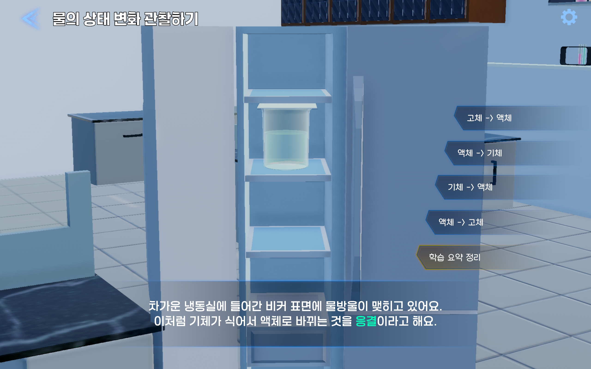

# 💧 물의 상태 변화 관찰하기 - Unity 3D 과학 시뮬레이션 콘텐츠

> **개발 플랫폼**: Unity 2022.3 LTS + URP  
> **디바이스**: Leia Lume Pad 2  
> **대상 학년**: 초등학교 4학년  
> **주제**: 물의 상태 변화 (융해, 기화, 응결, 응고), 물의 순환, 무게와 부피 비교

---

## 📸 콘텐츠 스크린샷

| 메인화면 | 진행선택 | 설정 |
|----------------|----------------|--------------|
|  |  |  |

| 물의 상태 변화 관찰하기 | 상태에 따른 무게와 부피 | 물의 순환 사이클 시뮬레이터 |퀴즈|
|----------------|----------------|--------------|--------------|
|  |  |  | |
|  |  |  | |
|  |  |  | |

---

## 🧪 콘텐츠 개요

- **상태 변화 실험**: 고체 → 액체 → 기체 → 액체 → 고체 전환을 단계별 시각화  
- **나레이션 연출**: 단계별 핵심 설명을 음성과 리치텍스트로 제공  
- **물의 순환**: 카메라 이동과 자연 소리, 팝업을 통한 순환 흐름 학습  
- **무게/부피 실험**: 상태 변화에 따른 물질의 성질 비교  
- **퀴즈 복습**: 정답 피드백과 학습 강화 퀴즈 포함  
- **설정 조절**: 3D 깊이감, 볼륨 등 유저 설정 저장 기능 제공

---

## 📚 적용 교과 단원 (2022 개정 교육과정 기준)

| 단원 코드 | 성취 기준 | 콘텐츠 연계 예시 |
|-----------|-----------|------------------|
| **[4과04-02]** | 물질이 열을 받거나 잃을 때 상태가 변함을 관찰한다. | 상태 변화 버튼을 누르며 실시간 실험 체험 :contentReference[oaicite:0]{index=0}:contentReference[oaicite:1]{index=1} |
| **[4과04-03]** | 고체, 액체, 기체의 상태에 따라 성질이 다름을 비교한다. | 무게/부피 비교 팝업을 통해 얼음/물/수증기 비교 :contentReference[oaicite:2]{index=2} |
| **[4과04-04]** | 물의 상태 변화가 물의 순환과 관련 있음을 이해한다. | 구름 이동/화살표 흐름 연출 + 카메라 이동 기반 팝업 제공 :contentReference[oaicite:3]{index=3}:contentReference[oaicite:4]{index=4}:contentReference[oaicite:5]{index=5} |
| **[4과04-05]** | 일상생활 속에서 물질의 상태 변화를 찾아 설명한다. | 퀴즈에서 생활 속 예시를 바탕으로 상태 변화 원리 확인 :contentReference[oaicite:6]{index=6} |

---

## 🔧 주요 스크립트 및 구성

| 모듈 | 스크립트 | 설명 |
|------|----------|------|
| 실험 컨트롤 | `ExperimentalController.cs` | 모든 상태 변화 단계별 시뮬레이션 로직 담당 |
| UI 버튼 연결 | `WaterStateChange_UIManager.cs` | 각 실험 버튼 동작 및 요약 호출 연결 |
| 나레이션 | `NarrationController.cs` | RichText 기반 타이핑 효과, 스킵, 자동 페이드 지원 |
| 요약 페이지 | `SummaryPopupController.cs` + `PopupPageData.cs` | 실험 후 개념 정리를 페이지별 팝업으로 구현 |
| 물의 순환 | `WaterCycle_UIManager.cs`, `CloudMoveLoop.cs`, `CycleArrowFlow.cs` | 카메라 이동, 구름 이동, 순환 애니메이션 포함 |
| 무게/부피 실험 | `MassVolumeController.cs` | 각 상태의 물리적 특성을 시각적으로 비교하는 기능 |
| 퀴즈 시스템 | `QuizSettingController.cs` | 학습 개념 강화용 9문항 퀴즈 및 정답 피드백 제공 |
| 시스템 설정 | `SoundManager.cs`, `SettingManager.cs`, `UpdateSettingSliderLabel.cs` | 3D/사운드 볼륨 설정 및 PlayerPrefs 저장 |
| UI/씬 관리 | `GameManager.cs`, `PausePopupController.cs`, `SplashLogoController.cs` | 씬 이동, 일시정지, 로고 애니메이션 등 포함 |

---

## 🗂️ 프로젝트 폴더 구조

```

Assets/
┣ Scripts/
┃ ┣ WaterStateChange/
┃ ┣ MassVolume/
┃ ┣ WaterCycle/
┃ ┣ Quiz/
┃ ┣ Core/
┃ ┣ UI/
┃ ┣ Shared/
┣ Resources/
┃ ┣ Sounds/
┃ ┣ ScriptableObjects/
┣ Scenes/
┣ Prefabs/
┣ screenshots/ ← GitHub 이미지 폴더

```

---

## 📎 실행 시 참고 사항

- **LeiaDisplay 컴포넌트**가 있는 디바이스(예: Lume Pad 2)에서 구동해야 입체 시각화가 활성화됩니다.
- Unity 2022.3 LTS + URP 기반으로 개발되었으며 DOTween, TextMeshPro, Leia SDK가 필요합니다.

---

## 🔗 추가 정보

- 📦 Leia SDK: https://docs.leiainc.com  
- 🎓 교육과정 출처: [2022 개정 초등 과학 4학년 성취기준](https://www.ncic.re.kr/)

